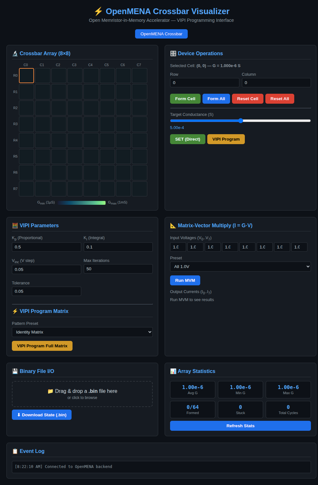

# OpenMENA API Library and Simulator



Welcome to the **OpenMENA API Library and Simulator**! This repository provides an interactive software simulator and a high-level Python API for the OpenMENA (Open Memristor-in-Memory Accelerator) platform. It allows researchers and developers to simulate, visualize, and experiment with memristor-based crossbars for neuromorphic edge-AI applications without requiring physical hardware.

This project is built upon the incredible foundational work of the **OpenMENA project**. 

**Original Paper:** [OpenMENA: An Open-Source Memristor Interfacing and Compute Board for Neuromorphic Edge-AI Applications](https://arxiv.org/abs/2511.03747)


## Features

- **Interactive UI Simulator:** A Node.js and C++ powered web interface to visually interact with and monitor the memristor crossbar state.
- **Python API (`openmena_api.py`):** A comprehensive Python library implementing:
  - Core device operations (forming, set, reset, read)
  - Voltage-Incremental Proportional-Integral (VIPI) programming
  - In-memory matrix-vector multiplications
  - Neural network inference and on-device learning
  - Hardware non-idealities simulation (noise, stuck faults, cycle endurance)
- **C++ Backend:** High-performance simulator backend for running crossbar operations.

## Prerequisites

Before getting started, ensure you have the following installed:

- **Node.js** (v14 or higher recommended)
- **npm** (Node package manager)
- **g++** (C++17 compatible compiler)
- **Python 3.x** (Dependencies listed in `requirements.txt`, if using the Python API)

## Installation & Setup

1. **Clone the repository and navigate into it:**
   ```bash
   git clone <repository-url>
   cd openMENA-api-library
   ```

2. **Install Node.js dependencies:**
   ```bash
   npm install
   ```
   *(This installs `express` and `socket.io` as defined in `package.json`)*

3. **Install Python dependencies (Optional, for API usage):**
   ```bash
   pip install -r requirements.txt
   ```

4. **Compile and run the server:**
   The `server.js` script will automatically invoke `g++` to compile the backend C++ simulation engine (`openmena_interactive.cpp`) and then start the server.
   ```bash
   node server.js
   ```

## Usage

### 1. Web UI Simulator

Once the server is running, open your web browser and navigate to:
- **OpenMENA Visualizer:** [http://localhost:3000/](http://localhost:3000/)

Through the visualizer, you can upload binary states, send commands, and monitor real-time conductance values, VIPI step iterations, and simulation statistics.

### 2. Python API

You can use the Python API for offline simulations, training scripts, or data analysis. 

**Example Usage:**
```python
import numpy as np
from openmena_api import OpenMenaBoard

# Initialize a 64x10 crossbar simulator
board = OpenMenaBoard(rows=64, cols=10)

# Simulate pre-trained weights transfer
trained_weights = np.random.uniform(-1, 1, (64, 10))
board.weight_transfer(trained_weights)

# Perform in-memory inference
input_image = np.random.uniform(0, 1, (64,))
logits = board.matrix_vector_multiply(input_image)
prediction = np.argmax(board.softmax(logits))

print(f"Predicted class: {prediction}")
```

## Attribution

**Original Paper:** [OpenMENA: An Open-Source Memristor Interfacing and Compute Board for Neuromorphic Edge-AI Applications](https://arxiv.org/abs/2511.03747)

**Authors:** Ali Safa, Farida Mohsen, Zainab Ali, Bo Wang, Amine Bermak

If you use this library in your research, please consider citing the original paper. These people are doing some incredible work.

## License

This project is released under the ISC License. See the `package.json` file for details.
